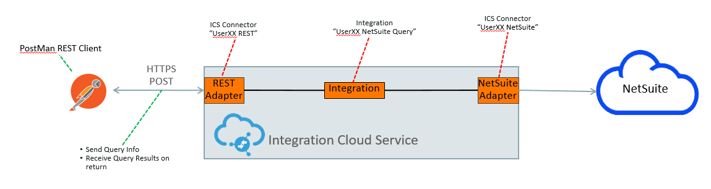
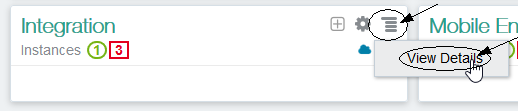
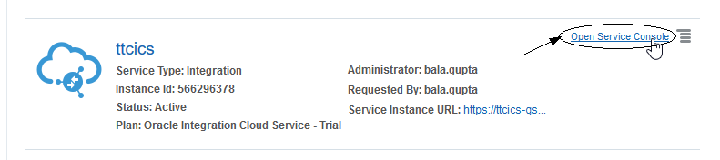
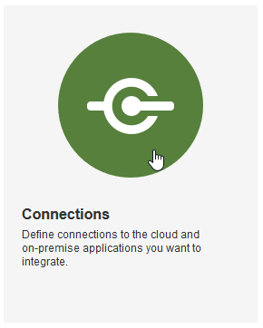
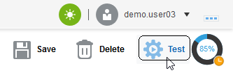

<center></center>

Update: May 1, 2017

# Lab 200 - Integrating with NetSuite using ICS

## Introduction

This is the second lab in the **Integrating with NetSuite using ICS Workshop**. 

In this lab, you will learn how to create an integration with NetSuite using a basic orchestration in ICS. 

The ICS integration that we'll be building is shown in the following picture:



Here is a description of what is happening with this integration:

Postman will be used to test the exposed REST service endpoint of the ICS integration called *UserXX NetSuite Query* (where XX will be 00 -> 10).  This integration has 2 connections.  The incoming message is received by the incoming *UserXX REST* REST Connection.  The *UserXX NetSuite Query* orchestration makes a query into the NetSuite SaaS application using the *UserXX NetSuite* connection to get details of the NetSuite business objects.  After the query is made, a few fields from the result are returned to the calling client, Postman.

## Objectives

- Learn how to create ICS REST and NetSuite Connections
- Learn how to create an ICS Orchestration using the ICS Adapters
- Learn how to test the ICS integration using Postman

## Required Artifacts

- The following lab and an Oracle Public Cloud account that will be supplied by your instructor.
- A NetSuite sandbox environment that will be supplied by your instructor.
- Postman will need to be installed for ICS integration testing - see "Prerequisites" section of the workshop for details

## Part 1: Create the ICS Connections

### **1.1**: Login to your Oracle Cloud account

---

**1.1.1** From your browser (Firefox or Chrome recommended) go to the following URL:
<https://cloud.oracle.com>

**1.1.2** Click Sign In in the upper right hand corner of the browser
**IMPORTANT** - Under My Services, change Data Center to `US Commercial 2 (us2)` and click on Sign In to My Services


**1.1.3** If your identity domain is not already set, enter it and click **Go**

**NOTE:** the **Identity Domain** values will be given to you from your instructor.

  

**1.1.4** Once your Identity Domain is set, enter your `User Name` and `Password` and click **Sign In**

***NOTE:*** the **User Name and Password** values will be given to you by your instructor.

  

**1.1.5** You will be presented with a Dashboard displaying the various cloud services available to this account.

**NOTE:** The Cloud Services dashboard is intended to be used by the *Cloud Administrator* user role.  The Cloud Administrator is responsible for adding users, service instances, and monitoring usage of the Oracle cloud service account.  Developers and Operations roles will go directly to the service console link, not through the service dashboard.


**1.1.6**  To get to the Integration Cloud Service (ICS) service console where you will work on developing the integration, click on the `hamburger` icon next to the *Integration* service, then click on the `View Details` link.



**1.1.7**  Select the `Open Service Console` link to go to the ICS Service Console.  

  

**1.1.8**  You will now be presented with the ICS Service Console from which you will be performing the rest of this workshop lab.

  

### **1.2**: Create the REST Connector

---

**1.2.1** Select the `Connections` graphic in the designer portal

 

**1.2.2** Click on **New Connection**

 

**1.2.3** Select the **REST** Connection, by either doing a search, or by scrolling down to the **REST** connection, then click on the **Select** button of the **REST** connection.


**1.2.4** Fill in the information for the new connection 

- **Name:** Enter in the form of _UserXX REST_ where XX is the number in your allocated user.
- **Role:** Select _Trigger_ since we going to use the connection as a trigger to start the integration

Note that the **Identifier** will automatically be created based on the **Name** you entered.

**1.2.5** Click **Create**

 

**1.2.6** We will keep the default of `Basic Authentication` in the *Configure Security* section. 

**1.2.7** At the top of the connection configuration screen, Click on the **Test** button to test the connection.

Note how the progress indicator will go from 33% to 100% after the connection tests successfully.


**1.2.8** Click on the **Save** button in the upper right corner of the connection configuration screen.

 

**1.2.9** Click on the **Exit Connection** button in the upper right of the connection configuration screen.


Your new REST connection appears in the list of configured connections and is even marked as **New** !

 

### **1.3**: Create the NetSuite Connector

---

**1.3.1** Select the `Connections` graphic in the designer portal

 

**1.3.2** Click on **New Connection** again

 

**1.3.3** Select the **Oracle NetSuite** Connection, by either doing a search, or by scrolling down to the **Oracle NetSuite** connection, then click on the **Select** button of the **Oracle NetSuite** connection.


**1.3.4** Fill in the information for the new connection:

- **Name:** Enter in the form of _UserXX NetSuite_ where XX is the number in your allocated user.
- **Role:** Leave the default setting of _Invoke_ since we going to call the connection as an invocation from the integration

Note that the **Identifier** will automatically be created based on the **Name** you entered.

**1.3.5** Click **Create**

 

**1.3.6** Click the **Configure Connectivity** button

 

**1.3.7** Enter the WSDL value given to you by your workshop instructor for the *Connection Properties*:

- **WSDL URL:** - `https://webservices.netsuite.com/wsdl/v2016_2_0/netsuite.wsdl` - this is an example of a NetSuite WSDL URL for the 16.2.0 release

 

**1.3.8** Next scroll down in the Connection Configuration page and select the **Configure Security** button.

 

**1.3.9** Enter the following attributes for the NetSuite connection security values.
  
*Note:* Your workshop instructor will tell you if these need to be changed.

- **Email Address:** - `kiran.mundy@oracle.com` 
- **Account:** - `TSTDRV1135946`
- **Role:** - `3`
- **Password:** - This will be given out by your instructor 
- **Application Id** - `69DDFD1A-640A-4FD0-9C2A-8C3F51F7E327`

**1.3.10** Click on the **OK** button to save the credentials.


**1.3.11** At the top of the connection configuration screen, Click on the **Test** button to test the connection.



Note how the progress indicator will go from 85% to 100% after the connection tests successfully.

 

**1.3.12** Click on the **Save** button in the upper right corner of the connection configuration screen.

 

**1.3.13** Click on the **Exit Connection** button in the upper right of the connection configuration screen.


Your new NetSuite connection appears in the list of configured connections and is even marked as **New** !

**Note** how the icon for the connection is different between the SOAP and Database connector.

 

## Part 2: Create the ICS Integration

---

### **2.1**: Create Orchestration Integration

**2.1.1** On the left-hand navigation of the Connections screen select the "Integrations" link


**2.1.2** Select the **New Integration** button in the top of the Integrations screen


**2.1.3** In the **Create Integration - Select a Style/Pattern**, select the **Orchestration** style.  We want to use this because our integration may have multiple invocations to the NetSuite system at a later point - the **Basic Map Data** style only has a single target service invocation as well as additional invocations for data enrichment of the payload before the target invocation call is made.


**2.1.4** Fill in the information for the new orchestration

- **What triggers this integration?:** Select the radio button for `Application event or business object`.  Note that integrations can be scheduled to run at specific times if the `Schedule` trigger type is selected.
- **What do you want to call your integration?:** Enter the name in the form of _UserXX NetSuite Query_ where XX is the number in your allocated user.
- **Identifier:** Accept the default - this value will be generated based on the name you enter.
- **Version:** Accept the default - if you want to clone and create newer versions later, you can change to a higher version than **01.00.0000** which is the default.

After you've filled in the information, select the **Create** button


**2.1.5** Observe the design canvas for the new integration.  (The various features of the ICS designer were covered in lab 100 **Exploring ICS** earlier in this workshop)


**2.1.6** Create the Trigger for the orchestration. This integration will have a REST endpoint as defined when we created the **UserXX REST** connector earlier.

Expand the list of REST Triggers by clicking on the **REST(X)** link (where `X` will be the number of REST connections in the ICS instance - this will vary depending on how many others are running the workshop together).

Click and drag your REST connection identified by your assigned user (ie: `UserXX REST`) over to the **Start** target.  

(Note: After you click and start dragging your connection, the `Triggers` connection tray on the left hand side of the designer will become hidden)


**2.1.7** Drop your connection onto the large *Plus Sign* inside the *Start* circle.


**2.1.8** Fill in the required values on **Basic Info** page, and click **Next >**

- **What do you want to call your endpoint?** _NetSuiteQuery_
- **What is the endpoint's relative resource URI** _/NetSuiteQuery_
- **What action does the endpoint perform?** _POST_
- **Configure a request payload for this endpoint** _Checked_
- **Configure for this endpoint to receive a response** _Checked_


**2.1.9** Select **JSON Sample**, select **JSON** in *type of payload* and click on **<<< inline >>>** to enter a sample JSON request payload


**2.1.10** Enter the following JSON into the **Enter Sample JSON**, then click **Ok**

```javascript
{
"parameter1":"string",
"parameter2":"string"
}
```


**2.1.11** Click on **Next >** to move on to the _Response_

**2.1.12** In the *Configure the Response Payload* screen, select **JSON Sample**, select **JSON** in **type of payload** and click on **<<< inline >>>** to enter sample JSON


**2.1.13** Enter the following JSON into the **Enter Sample JSON**, and click **Ok**

```javascript
{
"response1": "response string1",
"response2": "response string2"
}
```


**2.1.14** Back on the Response Page,  click **Next >**


**2.1.15** After reviewing the trigger details, click **Done**.


**2.1.16** The ICS design canvas will now show the Trigger named _NetSuiteQuery_ along with the mapping and return node of the same name.

**2.1.17** It is a good practice to periodically save your work.  Select the *Save* button in the upper right corner.


Click on the _echo_ **Map**, and then on _pencil_ icon


The _Mapper_ page will appear


**1.17** Drag the **\<\>\*echo** and drop on to **\<\> \*return** 


**1.18** Click on **Save** 


**1.19** Click on **< Exit Mapper**

You will notice that your flow is _all green_ now.


**1.20** Click on **Tracking**


**1.21** Drag **\*echo** across to the right hand side, under **Tracking Field**


**1.22** Click on **Done**

**1.23** Click on **Save** and the **< Exit Integration**


You should see your _New_ integration in list of _Integrations_


### Activating Integration

**1.1** Click on the switch next to your integration to activate


**1.2** On the **Activate Integration ?** popup window, select **Enable Tracing** and click on **Activate**


**1.3** Capture the link displayed after activation


If you need the URL again, you can always get back to it by clicking on the **i** icon of your active integration


## Testing Integration

Testing the activated integration can be done using multiple tools and depends on your preference. See each relevant product's website on how to install the tool, if required.

----

### **APIARY** Swagger	_WORK IN PROGRESS_

----

Apiary does not support Swagger (JSON) format at the moment, so we first have to convert the Swagger JSON into Swagger.

**1.1** Back in a browser window, open the URL we have captured in **Activating Integration**, step **1.3**. Append ***/swagger*** - supply your username and password if asked for it.


**1.2** Copy the Swagger text displayed in the browser window, it should look similar to the following. 

```javascript
{
  "swagger" : "2.0",
  "info" : {
    "description" : "Description of the service [Title is not available at Runtime unless we store it in JCA. Need to check for Description]",
    "version" : "1.0",
    "title" : "Title of the Service [Reference Binding Name]"
  },
  "host" : "ttcics-gse00003021.integration.us2.oraclecloud.com:443",
  "basePath" : "/integration/flowapi/rest/USERXX_HELLO_WORLD/v01",
  "schemes" : [ "https" ],
  "paths" : {
    "/echo" : {
      "post" : {
        "consumes" : [ "application/json" ],
        "produces" : [ "application/json" ],
        "parameters" : [ {
          "in" : "body",
          "name" : "request-wrapper",
          "required" : false,
          "schema" : {
            "$ref" : "#/definitions/echo"
          }
        } ],
        "responses" : {
          "default" : {
            "description" : "A sample description of the Response",
            "schema" : {
              "$ref" : "#/definitions/return"
            }
          }
        }
      }
    }
  },
  "definitions" : {
    "echo" : {
      "type" : "string"
    },
    "return" : {
      "type" : "string"
    }
  }
}
```

**1.3** Open http://editor.swagger.io 

**1.4** Open File -> Paste JSON...


**1.5** Paste the Swagger JSON in the text box, and click on **Import**


**1.6** In the editor you will see Swagger YAML. Copy this text.


**1.7** Log into APIARY 

>**Note:** Follow instructions on the APIARY website to create an account.

**1.8** Create new API, making sure to **Start your API in** _Swagger_


**1.9** Copy your selected text (from 1.6) into the editor in the left side


**1.10** Now, we have to add security definitions. 

- Change the code to the following, changes __marked <--__

```
swagger: '2.0'
info:
  description: >-
    Description of the service [Title is not available at Runtime unless we
    store it in JCA. Need to check for Description]
  version: '1.0'
  title: 'Title of the Service [Reference Binding Name]'
host: 'ttcics-gse00003021.integration.us2.oraclecloud.com:443'
basePath: /integration/flowapi/rest/USER10_HELLO_WORLD/v01
schemes:
  - https 
```
<-- Insert the following 
```
securityDefinitions:
  basicAuth:
    type: basic
    description: HTTP Basic Authentication. 
```
<-- Up to here
```
paths:
  /echo:
    post:
```
<-- Insert the following
```
      security:
       - basicAuth: []
```
<-- Up to here 
```
      consumes:
        - application/json
      produces:
        - application/json
      parameters:
        - in: body
          name: request-wrapper
          required: true
          schema:
            $ref: '#/definitions/echo'
      responses:
        default:
          description: A sample description of the Response
          schema:
            $ref: '#/definitions/return'
definitions:
  echo:
    type: string
  return:
    type: string

```

----

### **APIARY BluePrint**	

----


----

### **POSTMAN**	

----

**1.1** Got to URL **chrome:/apps** in _Chrome_ and open POSTMAN


**1.2** Click on the **Import** on the main title bar


**1.3** Back in a browser window, open the URL we have captured in **Activating Integration**, step **1.3**. Append ***/swagger*** - supply your username and password if asked gor it.


**1.4** Copy the Swagger text displayed in the browser window, it should look similar to the following. 

```javascript
{
  "swagger" : "2.0",
  "info" : {
    "description" : "Description of the service [Title is not available at Runtime unless we store it in JCA. Need to check for Description]",
    "version" : "1.0",
    "title" : "Title of the Service [Reference Binding Name]"
  },
  "host" : "ttcics-gse00003021.integration.us2.oraclecloud.com:443",
  "basePath" : "/integration/flowapi/rest/USERXX_HELLO_WORLD/v01",
  "schemes" : [ "https" ],
  "paths" : {
    "/echo" : {
      "post" : {
        "consumes" : [ "application/json" ],
        "produces" : [ "application/json" ],
        "parameters" : [ {
          "in" : "body",
          "name" : "request-wrapper",
          "required" : false,
          "schema" : {
            "$ref" : "#/definitions/echo"
          }
        } ],
        "responses" : {
          "default" : {
            "description" : "A sample description of the Response",
            "schema" : {
              "$ref" : "#/definitions/return"
            }
          }
        }
      }
    }
  },
  "definitions" : {
    "echo" : {
      "type" : "string"
    },
    "return" : {
      "type" : "string"
    }
  }
}
```

**1.5** Back in POSTMAN, select **Paste Raw Text**, and paste the text into the text box 


**1.6** Click on **Import** to import in POSTMAN


**1.7** Click on the **Authorization** tab


**1.8** Change the Authorization settings as follow:

- **Type**     _Basic Auth_

- **Username** _demo.userXX_

- **Password** _YOURPASSWORD FOR ICS_


**1.9** Click **Update Request**

**1.10** Click on the **Body** tab, make sure **raw** and **JSON(application/json)** is selected. Enter the following text in to the body text box

````javascript
{
    "echo":"Hello World!"
}
````


**1.11** Click on the blue **Send**. Look at the bottom to see the output, the Body should contain the following value, and the Status should indicate a **200 OK** 

````javascript
{
    "return":"Hello World!"
}
````


----

### **Swagger Editor**	

----

**1.1** Back in a browser window, open the URL we have captured in **Activating Integration**, step **1.3**. Append ***/swagger*** - supply your username and password if asked for it.


**1.2** Copy the Swagger text displayed in the browser window, it should look similar to the following. 

```javascript
{
  "swagger" : "2.0",
  "info" : {
    "description" : "Description of the service [Title is not available at Runtime unless we store it in JCA. Need to check for Description]",
    "version" : "1.0",
    "title" : "Title of the Service [Reference Binding Name]"
  },
  "host" : "ttcics-gse00003021.integration.us2.oraclecloud.com:443",
  "basePath" : "/integration/flowapi/rest/USERXX_HELLO_WORLD/v01",
  "schemes" : [ "https" ],
  "paths" : {
    "/echo" : {
      "post" : {
        "consumes" : [ "application/json" ],
        "produces" : [ "application/json" ],
        "parameters" : [ {
          "in" : "body",
          "name" : "request-wrapper",
          "required" : false,
          "schema" : {
            "$ref" : "#/definitions/echo"
          }
        } ],
        "responses" : {
          "default" : {
            "description" : "A sample description of the Response",
            "schema" : {
              "$ref" : "#/definitions/return"
            }
          }
        }
      }
    }
  },
  "definitions" : {
    "echo" : {
      "type" : "string"
    },
    "return" : {
      "type" : "string"
    }
  }
}
```

**1.3** Open http://editor.swagger.io 

**1.4** Open File -> Paste JSON...


**1.5** Paste the Swagger JSON in the text box, and click on **Import**


**1.6** In the editor you will see Swagger YAML. Change this text to add the security definition


- Change the code to the following, changes __marked <--__

```
swagger: '2.0'
info:
  description: >-
    Description of the service [Title is not available at Runtime unless we
    store it in JCA. Need to check for Description]
  version: '1.0'
  title: 'Title of the Service [Reference Binding Name]'
host: 'ttcics-gse00003021.integration.us2.oraclecloud.com:443'
basePath: /integration/flowapi/rest/USER10_HELLO_WORLD/v01
schemes:
  - https 
```
<-- Insert the following 
```
securityDefinitions:
  basicAuth:
    type: basic
    description: HTTP Basic Authentication. 
```
<-- Up to here
```
paths:
  /echo:
    post:
```
<-- Insert the following
```
      security:
       - basicAuth: []
```
<-- Up to here 
```
      consumes:
        - application/json
      produces:
        - application/json
      parameters:
        - in: body
          name: request-wrapper
          required: true
          schema:
            $ref: '#/definitions/echo'
      responses:
        default:
          description: A sample description of the Response
          schema:
            $ref: '#/definitions/return'
definitions:
  echo:
    type: string
  return:
    type: string

```

**1.7** Next we have change the input/out parameters

In the parameters and reponses, we have to change the definitions:

```` javascript

parameters:
        - in: body
          name: body
          description: Updated user object
          required: true
          schema:
            $ref: '#/definitions/echoBody'
      responses:
        '200':
          description: successful operation
          schema:
            $ref: '#/definitions/return'
        default:
          description: Error occured

````

And then define the schemas under definitions

```` javascript
definitions:
  echoBody:
    type: object
    properties:
      echo:
          type: string 
  return:
    type: object
    properties: 
      return:
        type: string
````

The result should be similar to the following 

```` javascript
swagger: '2.0'
info:
  description: >-
    Description of the service [Title is not available at Runtime unless we
    store it in JCA. Need to check for Description]
  version: '1.0'
  title: 'Title of the Service [Reference Binding Name]'
host: 'ttcics-gse00003021.integration.us2.oraclecloud.com:443'
basePath: /integration/flowapi/rest/USER10_HELLO_WORLD/v01
schemes:
  - https
securityDefinitions:
  basicAuth:
    type: basic
    description: HTTP Basic Authentication. 
paths:
  /echo:
    post:
      security:
       - basicAuth: []
      operationId: HelloWorld
      consumes:
        - application/json
      produces:
        - application/json
      parameters:
        - in: body
          name: body
          description: Updated user object
          required: true
          schema:
            $ref: '#/definitions/echoBody'
      responses:
        '200':
          description: successful operation
          schema:
            $ref: '#/definitions/return'
        default:
          description: Error occured
definitions:
  echoBody:
    type: object
    properties:
      echo:
          type: string 
  return:
    type: object
    properties: 
      return:
        type: string
````

**1.8** Do the authentication call


**1.9** Fill in your username and password for ICS, and click **Authenticate**


**1.10** Click **Try this operation**


**1.11** Fill in our **echo** value. Notice the change in the body underneath, click on **Send Request**


**1.12** Result


----

### **SOAPUI**

----

**1.1** Open SOAPUI


**1.2** Right click on **Projects** and select **Create Empty Project**


**1.3** Right click on the new **Project1** and select **Import Swagger**


**1.4** Fill in the **Swagger Definition:** using the URL we have captured in **Activating Integration**, step **1.3**. Append ***/swagger*** 
Click on **OK** to import Swagger from ICS


**1.5** When asked for credentials, enter your ICS user credentials


**1.6** Expand **Project 1** to show the **Request 1**. Double Click the **Request 1** to open the Request Window


**1.6** Click on the Auth tab on the left hand bottom of the **Request 1** Window and select **Add New Authorization**


**1.7** Select **Basic** in the popup window


**1.8** Fill your username and password


**1.9** Fill in the request body with following JSON:

```javascript
{ "echo": "Hello World!" }
```


**1.10** Click on the green **Run** triangle at top **Request 1** Window

**1.11** Last step is to switch to JSON Format in the output panel


And you should be able to see an **echo** of your input in the output panel 


- This Lab is now completed.


